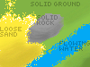

# The voxel game I wanted to make

I mostly wanted to make terrain generation and trees and foliage generation. I also wanted it to have flowing water and sand and more. An awesome thing about terrain is the many different kinds of stone and dirt. It would be fun to make terrain that looked good.

The terrain will have tall mountains and valleys and long rivers. The forests are dense and there are many different kinds of forests with different kinds of trees. Different trees appear in different temperatures and rainfall and elevations. It will have small voxels. Grass and leaves sway in the wind, and water flows in rivers.

In MC, it is sometimes annoying that the blocks are big, and you can't make something out of blocks that falls and slides down hills.

## What I want the game to be like

to add: more example images

Jun 27, 2025: I walked around and imagined what the voxel/simulation could be like: A mountain slope with a small wood hut and presence of tall trees in the distance, bird sounds, walking into the hut and wood stepping sounds. Going to the bottom of the valley, a river flowing from left to right and more dense trees on the other side, water flowing sounds, tall mountain on the other side with yellow sunlight and shadow cast by other mountains. Looking at a sloped valley going down side of hill in the shadow, some trees around, rain falling. Rain in a city, looking at the water flowing from tall building to gutter on the ground. I thought about how it could have complicatedely connected things, like water streams.

### Example Gameplay

The player held a stone pickaxe. He raised it and hit the stone on the hill with it. The stone broke off. The player picked up the stone piece and walked away.

The player was in a desert filled with sand. He walked and looked for water. After a while, the player found a large puddle of clear water in a place surrounded by higher land. The player went in the puddle and walked around. The water splashed as he walked. He finds a cave next to it and decides to make his base there.

## Details

The voxels are small. 1/16 meter is good. The voxels are also particles, and can move around.

There are many types of materials like: Grass, Soil, Stone (Limestone, Sandstone, Granite, Basalt, Slate, ...), Wood (Oak Wood, Birch Wood, ...), Leaf (Oak Leaf, Maple Leaf, ...), Fern, Flower, Water, Oil, Salt, Coal, Iron, Diamond  
See [Sandboxels](https://sandboxels.r74n.com) for more types of materials (elements).

They can also be mixed together. For example, a voxel with `{soil:1, water:1}` is mud. `{wood:1, oak:1}` is oak wood. `{soil:1, clay:1}`is clay soil. `{water:1, salt:1}` is salt water.

* Water, oil, lava, etc. They flow and splash.
* Sand, soil, wood dust, etc. They can pile up and slide.
* Solids: Wood planks, tree branches, the ground made of stone, rocks, sticks, etc. They are rigid most of the time, but can break and fracture when bent or hit.

When wood is broken enough, it can turn into wood dust. So can stone.

It can erode the terrain in real time. Water picks up sediments like dirt and stone and sand. When the water moves down the hill, it moves the sediment down too. This can make rivers that go into bigger rivers and jagged mountain peaks. (Maybe the water can move them up, so it won't keep getting flatter.)

Rivers can also flow in real time. The rivers flow from mountains and combine and flow into valleys and into oceans.

Around Mar 2024: I thought about small voxels but in a new game. It could load chunks that had water flowing to already loaded chunks, to keep rivers flowing. While going downhill on the trail, I thought that further chunks could be simulated slower.

Tree and plants could grow in real time too. The branches get thicker over time, and new branches grow longer and grow leaves and buds. (types: oak leaf, oak bud, oak wood, oak bud growing, etc.) In autumn, the leaves fall onto the ground, and decay (disappear). Seeds can also fall and grow into new trees if there is enough space.
Around Jun 2024, I thought: There could be a line of active voxel in the center of branches. The center voxels could have a timer and when it resets, they spawn a new ring of branch voxels that is 1 unit wider.

Grass gets taller. It could spawn a new voxel above when its timer resets. It spawns grass seeds which grow into new grasses.

The player is also made of voxels. They interact with the world physically. To move, the player's velocity could be increased. They can hold and pick up things. When the player falls or gets hit, the part that got damaged loses health points. Parts: head, arm, leg, etc.

There could be a picture of the player in the top left. If a part was hit, it flashes red. (like in Minecraft but more detailed) If a part is seperated or gone, it is transparent.

How it can generate terrain: It generates a base noise map. It can use perlin noise or simplex noise. Another kind of noise is a kind of voronoi noise but each cell has a random height and it interpolates (smoothes) it.  Another kind of noise is white noise that is low frequency filtered. After generating noise, it can do erosion simulation on the noise map. [Erosion](https://nickmcd.me/2022/04/15/soilmachine/)

It will have multiplayer, so there will be other players. But how will the physics be done? It is better to run physics on the server, because it will be simpler. This may have a delay when players try to move. Running physics on client side would be smoother and have less delay, but it would need more code and the server would need to check if it moves correctly and synchronize.

The graphics could be ray traced. Each voxel has a color and smoothness and normal (direction of the surface). The rays go straight but bounce off voxels. A way to make it less noisy is to store the average light recieved in each voxel. When the ray hits a voxel, it could use the voxel's average light value.

The worlds can be infinite, or round. For round worlds, there is a planet, which is a big ball made of voxels. The voxels shouldn't be stretched or distorted, just a voxel ball. There could even be a round sun made of voxels, that the planet orbits. It would have gravity, and each voxel has mass. This is very complicated, so probably don't make it.

## Technical details

It should be moddable and the mods can add new types of materials and behaviors. It can also have multiple formats for storing voxels. [The perfect voxel engine](https://voxely.net/blog/the-perfect-voxel-engine/)

For solid objects, all the voxels in a solid object could be stored in a voxel grid.

One way to simulate breaking: When it is breaking, the voxels next to the crack become seperate from the solid object. When the pieces are not connected anymore they also become seperate solid objects. The problem with this is that it doesn't actually bend. And how does it determine where it should be cracking?

Mar 10 2025, from [my post](https://thingmaker.us.eu.org/post/?id=m7cllbb5bc9f): Voxels have attributes like color and material type, which should be changeable. To store them, there can be a octree for each attribute.

to add: example image of attributes

It can be done on a gpu which is faster. GPUs can run code in parallel (thousands of times at the same time). It would be very hard to make this voxel game run on a gpu.

Mar 10 2025, from [my post](https://thingmaker.us.eu.org/post/?id=m7cllbb5bc9f): Problem: how can a world be simulated if not everything is loaded? If everything is loaded, there may not be enough memory.

When things like water are not moving or moving slowly, smaller water particles can be combined into bigger water particles to save memory and computation. When many solid objects are close together and not moving, they can also be combined into one grid to save memory and computation.

What if it used AI to automatically optimize? Jun 5, 2025: When optimizing particles into voxels, the loss could be the similarity of the position and velocity

# End

I tried to make a voxel game a few times since Mar 2024. I started making [Leafbuild](https://thingmaker.us.eu.org/lfbd/prealpha-0.1.0.html) on Mar 17, 2024, and spent 5 months, almost entire day every day. It was too hard to make engine related things like data structures have good performance and low memory usage. I also don't really want to make things that will be gone eventually. But I still think that it is a awesome idea.

Maybe someone else can make the voxel engine.
